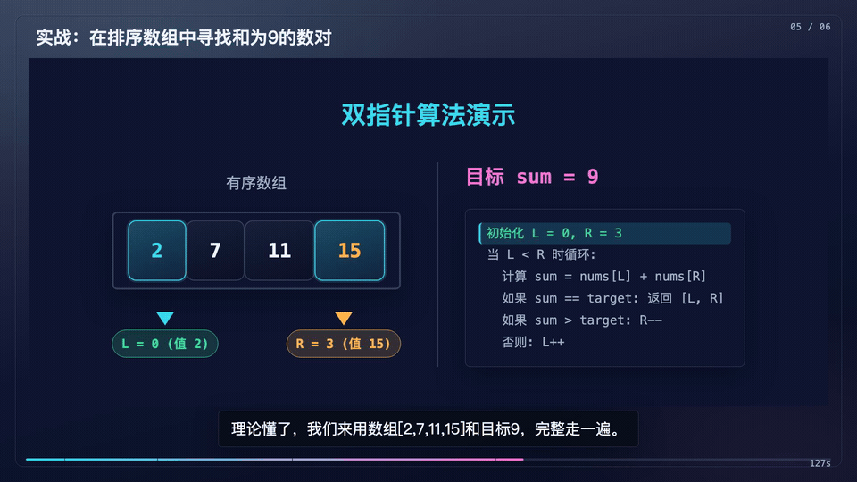
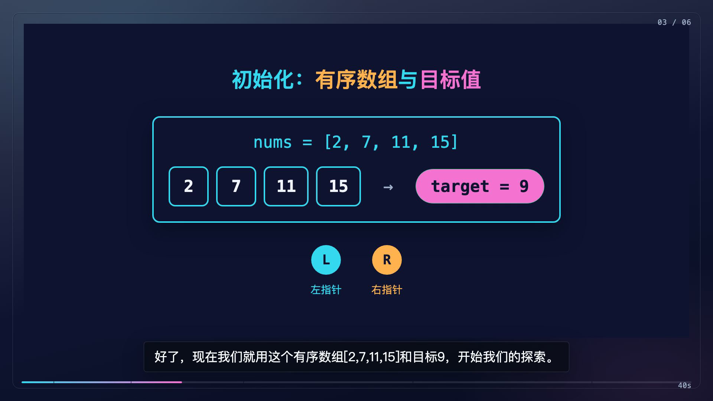
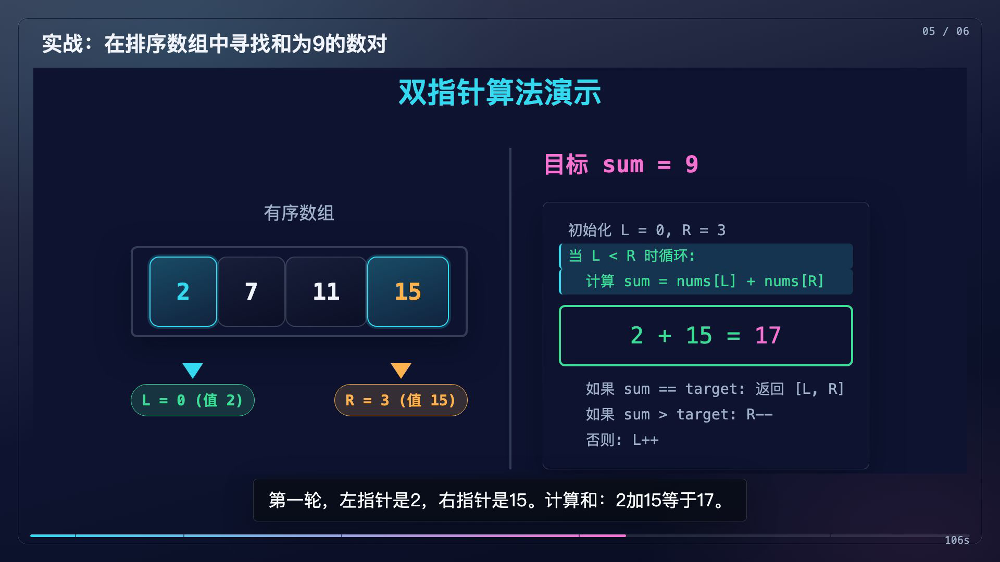
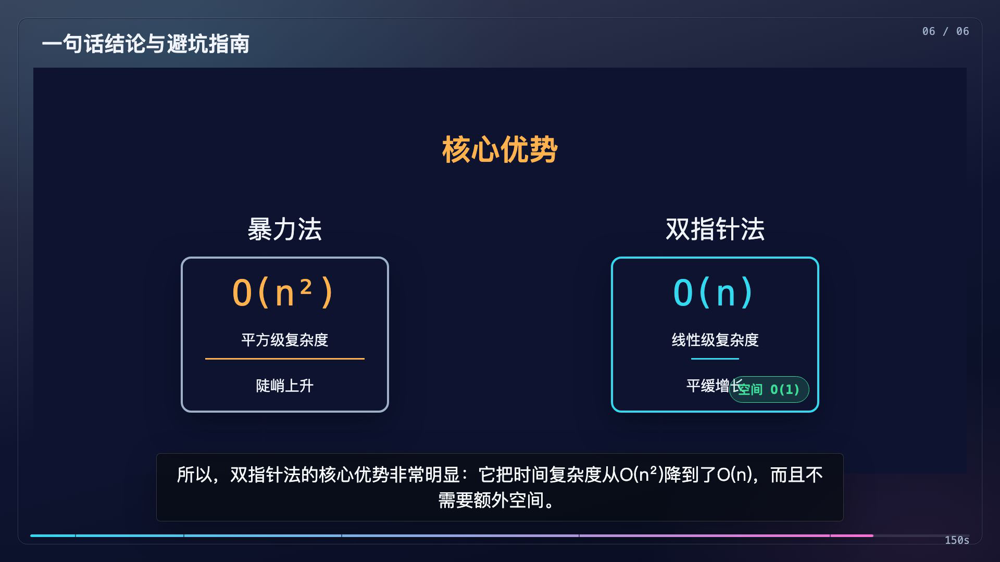
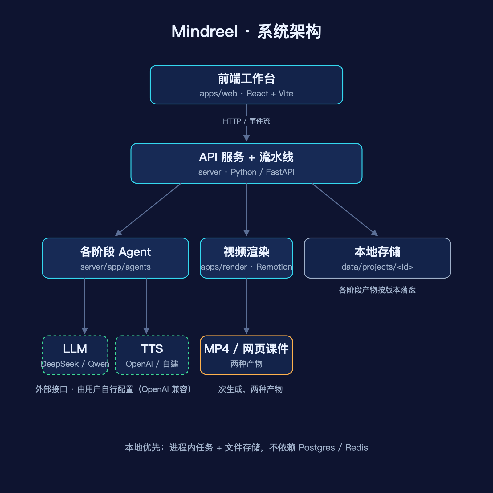
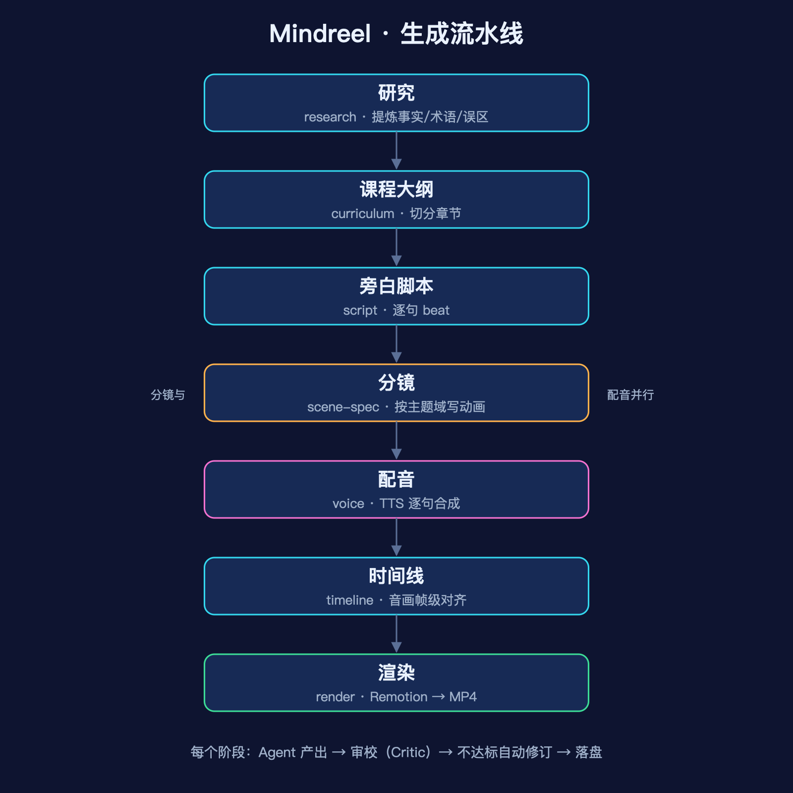

<div align="center">

# 🎬 MindReel

**Give it a topic, get back a narrated, animated explainer video.**

You type a topic — research, outline, script, scene design, voiceover, alignment, and
rendering all happen automatically. You get an MP4, plus an interactive web deck you can
open and play right in the browser.

English · [简体中文](README.md)

[](LICENSE)
[](package.json)
[](https://github.com/sxxss/MindReel/actions/workflows/ci.yml)
[](#local-development)
[](#local-development)
[](CONTRIBUTING.md)

[Quick Start](#-quick-start) · [Demo](#-demo) · [Configure models](#-configure-models) · [How it works](#-how-it-works) · [Architecture](docs/ARCHITECTURE.md)

<br/>



<sub>A clip from the auto-generated video for "two sum (two pointers)": code, the array, the pointers, and live computation move together on one screen — the picture follows the narration.</sub>

</div>

---

## ✨ What's different

| | |
|---|---|
| 🎯 **Visuals follow the topic, not a template** | It detects the topic's domain, then has the model author each scene's visuals: code and arrays for algorithms, sequence diagrams for networking, formulas and geometry for math. |
| 🎙️ **Narration and visuals aligned sentence by sentence** | The picture stops on the step the narration is talking about — it cuts on the real voiceover duration, so audio and video don't drift apart. |
| 📦 **One run, two outputs** | A publishable MP4, and an interactive web deck you can click through, page, and share offline. |
| 🎨 **Switchable themes, even for old projects** | Visual themes are defined with CSS variables, so re-skinning is just swapping a set of values — already-generated projects don't need regenerating. |

> Early stage (v0.x): the end-to-end pipeline is fully working and produces complete videos; the quality of the visuals and narration scales with the model you use. See [Known limitations](#-known-limitations) for the boundaries.

## 🎥 Demo

A few auto-generated frames for the topic "two sum (two pointers)". Code, the array, the pointers, and live computation move together on one screen, and the picture follows the narration.

| Setup | Walkthrough (code + pointers + live compute) | Complexity comparison |
|:---:|:---:|:---:|
|  |  |  |

> 💡 **Want to look before installing anything?** Download [`examples/two-pointer-deck.html`](examples/two-pointer-deck.html) and open it in a browser to play it sentence by sentence — that's the "web deck" output.

> The algorithm and networking domains are the most tested. Math, physics, biology, history, economics, etc. have built-in visual guidance but are not individually verified yet — feedback welcome.

## 🚀 Quick Start

### With Docker (only Docker required locally)

```bash
git clone https://github.com/sxxss/MindReel.git
cd MindReel
docker compose up -d
```

The image already bundles Node, Chromium (for rendering), ffmpeg, and CJK fonts, so you don't install those yourself. Open **http://localhost:5173**, set up your models on the `/providers` page, and you're ready.

### Local development

Requires **Python 3.11+, Node 22+, pnpm 11+, and ffmpeg**. The backend is Python (FastAPI), video rendering is Node/Remotion, and the frontend is React.

```bash
pnpm install                       # frontend / render deps
python -m venv server/.venv && source server/.venv/bin/activate
pip install -r server/requirements.txt

pnpm dev:api      # start Python API (4123)
pnpm dev:web      # start Web (5173)
```

## 🔌 Configure models

MindReel doesn't bundle any LLM or TTS — you point it at your own services on the `/providers` page. There are one-click presets that fill in the Base URL and model; you just add your API key.

<table>
<tr><th>Type</th><th>Options</th></tr>
<tr>
<td><b>LLM</b><br/>(pick one)</td>
<td>

- **DeepSeek** — cheap, decent quality, **recommended**.
- **Qwen / OpenAI** — or any OpenAI-compatible endpoint.
- **Ollama** — run an open model locally, free.

</td>
</tr>
<tr>
<td><b>TTS</b><br/>(pick one)</td>
<td>

- **OpenAI TTS** — official, stable.
- **Self-hosted** — any service compatible with `/v1/audio/speech`.

</td>
</tr>
</table>

> ⚠️ With Docker: `localhost` inside a container refers to the container itself. To reach a service on the host (e.g. a local Ollama), use `http://host.docker.internal:<port>`.

## ⚙️ How it works



The web app calls the Python (FastAPI) backend; the backend runs the generation pipeline asynchronously and streams progress back over SSE. Each stage calls your configured LLM or TTS, and artifacts are saved to local files by version. Rendering is handled by Node/Remotion, which the backend invokes as a subprocess — both sides share the same `data/`.

The pipeline has these stages, and **every stage's output is persisted, so changing one stage only requires re-running the stages after it**:



| Stage | Output | What it does |
|---|---|---|
| `research` | knowledge | Extracts facts, terms, and common misconceptions from the topic |
| `curriculum` | curriculum | Splits into hook / concept / derivation / example / recap chapters |
| `script` | script | Writes narration per chapter; each sentence is a beat (4–6s) |
| `scene-spec` | scene-spec | Has the model author a self-contained HTML animation per scene, by domain |
| `voice` | voice-track | Synthesizes audio per beat via TTS and records the real duration |
| `timeline` | timeline | Uses the real audio duration to align picture steps to narration |
| `render` | render | Renders to MP4 |

The **scene-design (`scene-spec`) step is the distinctive one**: instead of a fixed template, the model writes a self-contained HTML animation for each scene based on the topic's domain.

See [docs/ARCHITECTURE.md](docs/ARCHITECTURE.md) for more.

## 📂 Layout

```
server/         Python backend (FastAPI)
  app/agents/   Per-stage agents (research/curriculum/script/visual-director/voice) + timeline solver
  app/          Pipeline orchestration, jobs/events, providers, storage, render bridge, API
apps/
  web/          Studio frontend (React + Vite + Tailwind)
  render/       Video rendering + web-deck export (Remotion / Node, called by the backend)
packages/
  shared/       Shared types and validation (Zod, used by the frontend too)
  scenes/       Scene templates (Remotion components)
```

## 🛠️ Common commands

```bash
pnpm dev:api      # start Python API (needs server deps installed)
pnpm dev:web      # start Web
pnpm typecheck    # type-check frontend / render / shared
pnpm build        # build
pnpm test         # run tests
```

## ⚠️ Known limitations

- **Output quality varies with the model.** The same topic won't produce identical results twice, and occasionally a scene's layout isn't ideal. There's retry and fallback so a single bad scene won't fail the whole video, but not every frame is guaranteed perfect.
- **Generation is slow and cloud models are billed per use** — a full video makes several model calls. Ollama is free but slower.
- **Stronger models give better narration and visuals.**

## 🤝 Contributing

Contributions welcome! See [CONTRIBUTING.md](CONTRIBUTING.md) for the dev setup and conventions. If this project helps you, a ⭐ is the best encouragement.

## ⭐ Star History

<a href="https://star-history.com/#sxxss/MindReel&Date">
  
</a>

## 📄 Dependencies and license

This project's code is [MIT](LICENSE) licensed (© 2026 baba). One dependency's license is worth noting:

> **Rendering uses [Remotion](https://www.remotion.dev/)**, which has its own license — free for individuals and small teams, but companies above a certain size need a paid Remotion license for commercial use. **Check Remotion's license before commercial use.** This is independent of this project's MIT license.

Other dependencies use common permissive licenses (MIT / Apache). You bring your own LLM and TTS; the generated content depends on your topic and chosen model, so verify its compliance yourself.
